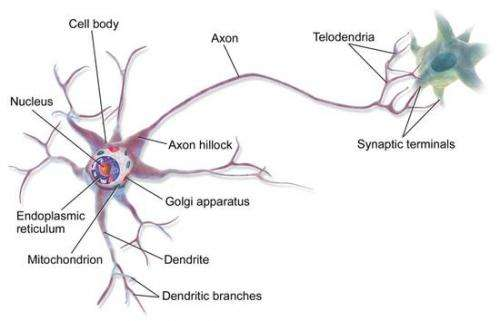
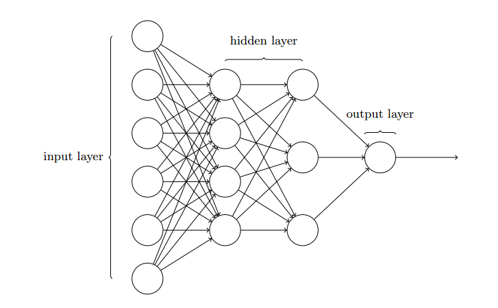
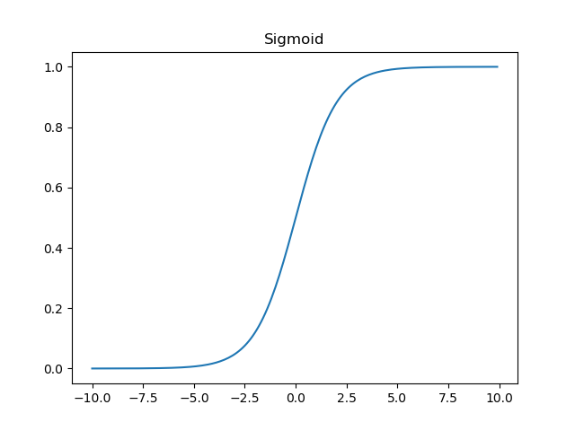
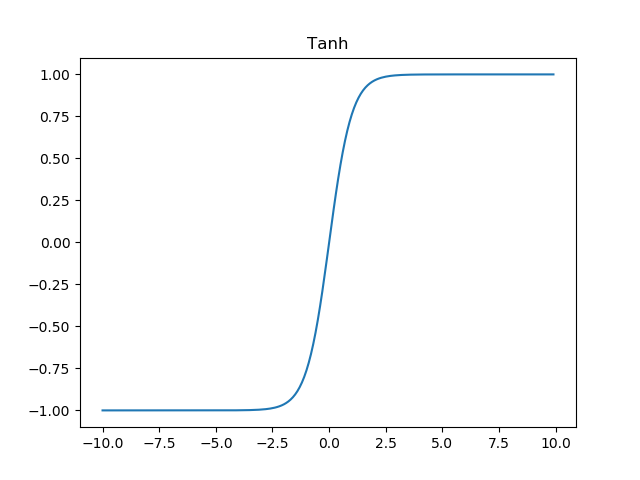
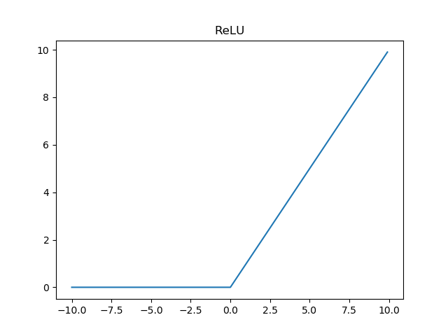

神经网络是有史以来人类最接近“智能”的一次尝试，尽管就目前而言，这项技术与图灵测试所定义的智能存在极大的差距，但是它独特的解决问题的角度和方式，堪称一项伟大而优美的发明。神经网络起源于对人类大脑学习、思考和记忆产生的研究，说白了就是在研究造物主是如何创造我们的智慧的。虽然现阶段脑科学、神经科学和计算机科学还有很多关键问题仍待突破，但是神经网络和一系列衍生的应用已经能够达到商用级别，它的跨领域渗透能力在未来的发展中存在巨大的潜力，并将深刻的变革现代信息社会

神经网络同时也是有史以来发明的最优美的编程范式之一，在传统的编程中，人们告诉计算机做什么，把大问题分成许多小的、精确定义的任务，计算机可以很容易的执行。相比之下，在神经网络中，我们不会告诉计算机如何解决问题，而是让它在数据中学习，从而找到解决问题的方法

本文是一篇关于神经网络的综述性文章，包括对神经网络发展历史、基本概念、目前发展现状以及前沿领域的介绍

## 历史

深度学习模型来源于从生物大脑(无论是人类大脑还是动物大脑)中受到的启发

听觉、视觉、触觉、味觉，通过身体不同器官，最终都将转化为生物电信号从末梢神经一层一层传递到大脑的深层神经网中，思维的过程也是电信号在成百上千亿神经元之间非常快速的传递过程。传统生物学中认为，大脑中的不同区域有着不同的功能，专门用于处理语言、图像、运动等问题，但是最新的研究结果表明，在专门处理某类问题的区域上长期施加另一类信号的刺激，这个区域能够适应并处理这些刺激，例如在舌头上放置声音转换成电信号的刺激装置让舌头能够“听”声音，在手臂上放置超声波距离转换成电信号的刺激装置能够让皮肤“看”前方的障碍物。这说明大脑中这种神经元构成的网状结构是一种极其通用化的学习模型，能够对任何外界的刺激做出反应

深度学习中的神经网络是由两个主要观点驱动的：
* 大脑模型是一个很好的例子来证明智能行为的可能，从这一点出发，创造智能最直截了当的方向是运用逆向工程对大脑背后的运作原理进行分析并复制
* 理解大脑和人类智能的基础原理本身是非常有趣的，因此深度学习模型除了解决工程应用之外，对于研究阐明大脑、神经等基本科学问题也是有作用的

### 3个命名阶段
概括地说，深度学习的发展经历了三个阶段
* **cybernetics** 20世纪40-60年代的深度学习被称为控制论
* **connectionism** 20世纪80-90年代神经网络被称为连接主义
* **deep learning** 2006年开始以深度学习命名

上图中显示了3次人工神经网络研究的历史浪潮中的两次，第一次浪潮始于20世纪40年代至60年代的控制论，随着生物学习理论(McCulloch and Pitts, 1943; Hebb, 1949)的发展，Rosenblatt实现了第一个感知器模型(Rosenblatt, 1958)，允许训练单个神经元。第二次浪潮始于1980-1995年期间的连接主义方法，用反向传播(Rumelhart et al., 1986)来训练一个带有一个或两个隐藏层的神经网络。第三次浪潮始于2006年(Hintonet al., 2006; Bengio et al., 2007; Ranzato et al., 2007a)

在上个世纪60~90年代，神经网络的研究较为缓慢，研究者发现了处理神经网络的计算机器的两个关键问题。第一个问题是单层神经网络不能处理异或电路。第二个重要问题是计算机不够复杂，无法有效地处理大型神经网络所需的长时间运行。然而20世纪末期直到今天，由于第三次工业革命，信息的产生呈爆炸式增长，计算机的性能也有了极大的提升，这使得大型深层次的神经网络成为可能，其性能也在高速增长

## 神经网络框架
基本的神经网络结构如下图所示

最左侧的称为**输入层**，其中的神经元称为输入神经元，最右边的称为**输出层**，中间层被称为**隐藏层**。这种结构在有些地方也被称为MLP(多层感知器)

网络中的每个神经元都是一个最简单的线性模型
$$
y = \omega{x} + b
$$

其中$\omega$和$b$分别叫做神经元的权重和偏置。神经网络的运行，是从输入层向输出层，一层一层传递结果的，上一层的输出作为下一层的输入，最终传递到输出层，而每个神经元上的权重和偏置的微笑改变，都会影响最终的输出。学习的本质就是不断地调整这些神经元上的权重和偏置值

### 激活函数
对于某一个神经元而言，由于简单的权重和偏置会导致单个神经元对网络的影响过大，因此引入了激活函数将单个神经元的影响平滑化。目前常用的激活函数有4种
* **Sigmoid** S型生长曲线
* **tanh** 双曲正切函数
* **ReLU** 线性整流函数
* **Maxout**

#### Sigmoid
Sigmoid函数的定义如下

$$
f(x) = \frac{1}{1 + e^{-x}}
$$

Sigmoid函数的图像如图所示

sigmoid函数当输入x趋近于负无穷时，输出y趋近于0，当输入x趋近于正无穷时，输出y趋近于1，即把输入归一化到0~1范围内

#### tanh
tanh函数的定义如下

$$
f(x) = \frac{e^x - e^{-x}}{e^x + e^{-x}}
$$

tanh函数的图像如图所示

#### ReLU
ReLU函数定义如下

$$
f(x) = max(0, x)
$$

ReLU函数的图像如图所示

当输入x小于0时输出为0，当大于0时输出y

激活函数各有优劣，适用于不同的应用场景，合理选择才能达到好的效果

### 代价函数、梯度下降
神经网络的学习，其目的是要达到给定训练样本${(x1,y1),(x2,y2)...}$，训练网络后，使得网络对于未知的输入数据能够尽可能逼近真实的输出。常用以下函数来描述这一目标，称作代价函数

$$
C = \frac{1}{2n}\sum_{x}\vert{y(x) - a^{L}(x)}\vert^2
$$

其中$n$是训练样本总数，$L$表示网络层数，$a^{L}(x)$是网络输入为$x$时的激活向量

当代价函数被定义好了之后，如何通过代价函数来调整网络呢？要想让网络的输出尽量逼近真实值，则要将代价函数最小化。通常要最小化函数是通过求导取极值来实现的，但是对于神经网络而言，输入$x$通常不是一个变量，而是一组变量构成的向量，因此代价函数其实是个多元函数$C(x1,x2,x3...)$，其最小化通过梯度下降算法来实现。梯度是数学上多元函数偏导数的概念，梯度永远指向函数下降最快的方向，梯度下降算法的思想是每次将代价函数减去一个由梯度和一个步长构成的微小值，那么经过多次迭代，代价函数总是朝着最小值逼近，最终代价函数趋近于最小值不再变化时，表明网络已经收敛

## 发展现状
一般在具体应用领域中不会直接使用这种基本的神经网络结构，在长时间的发展中，针对不同种类的问题，神经网络已经演化出了多种结构
* CNN(Convolutional Neural Network，卷积神经网络)，适用于图像识别领域
* RNN(Recursion Neural Network，递归/循环神经网络)，适用于语音、文字处理
* LSTM(Long Short-Term Memory Network，长短记忆网络)，RNN的改进版
* DBN(Deep Belief Network，深度信念网络)，多个神经网络堆叠，适用于识别
* GAN(Generative Adversarial Network，生成对抗网络)，用于自学习

目前神经网络也已经有很多成熟的开发框架
* sklearn
* caffe
* pytorch
* tensorflow
* keras

## 参考
1. Michael A. Nielsen, "Neural Networks and Deep Learning", Determination Press, 2015
2. Ian Goodfellow and Yoshua Bengio and Aaron Courville, "Deep Learning", MIT Press, 2016
3. wikipedia:[Neural network](https://en.wikipedia.org/wiki/Neural_network)
