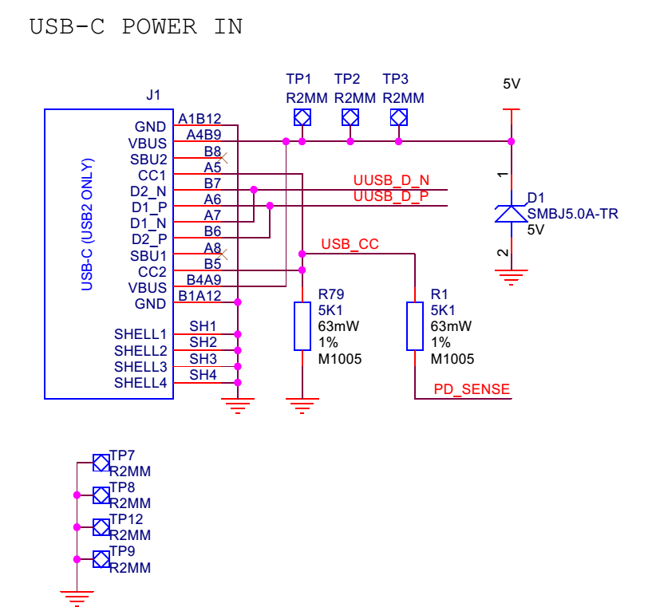
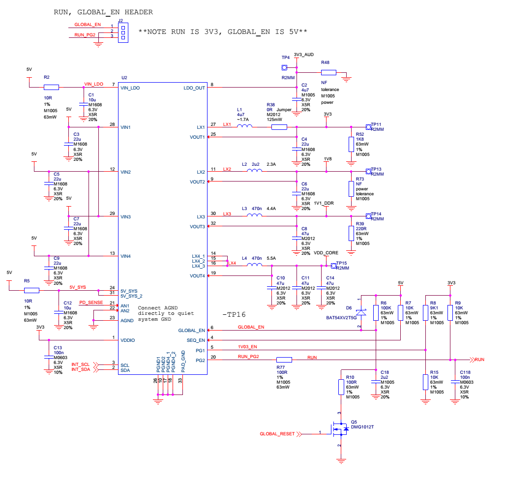
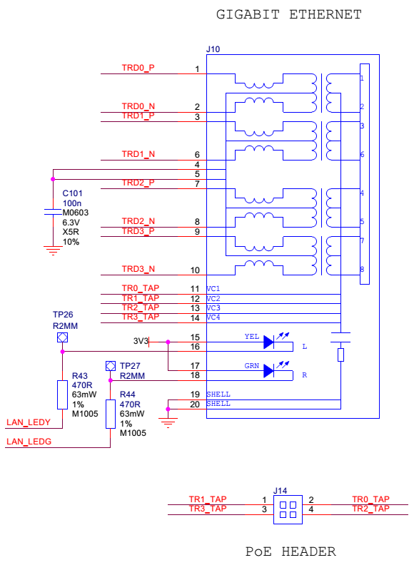
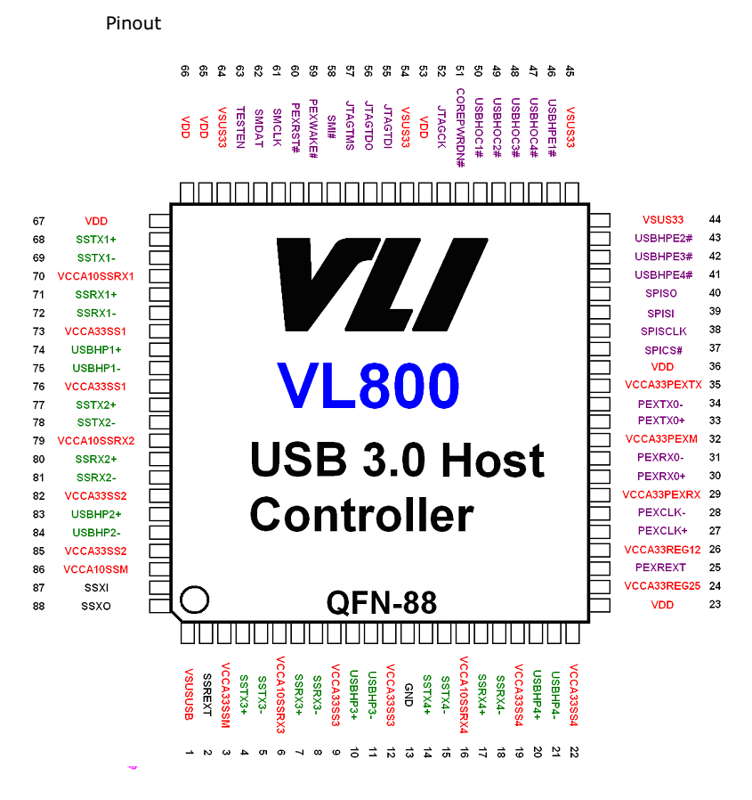

## Reference
目前很多资料还不全面，官网发布的原理图也只有一小部分
* [product Brief (PDF)](/download/Raspberry-Pi-4-Board/Raspberry-Pi-4-Product-Brief.pdf)
* [Schematics (PDF)](/download/Raspberry-Pi-4-Board/rpi_SCH_4b_4p0_reduced.pdf)
* Power [MxL7704 Datasheet (PDF)](/download/Raspberry-Pi-4-Board/mxl7704.pdf)
* Ethernet [BCM5421 Datasheet (PDF)](/download/Raspberry-Pi-4-Board/5421-PB05-R.pdf)
* USB Host Controller [VL805 Datasheet (PDF)](/download/Raspberry-Pi-4-Board/20120517130647131.pdf)
* Memory [MT53D1024M32D4DT-053 WT:D Datasheet (PDF)](/download/Raspberry-Pi-4-Board/16Gb_32Gb_x4_x8_3DS_DDR4_SDRAM.pdf)

## Power
Raspberry Pi 4 使用USB-C供电，其使用的电源管理芯片是MaxLinear公司的MxL7704

MxL7704是一款五输出通用PMIC(Power Management IC)，针对为低功耗FPGA、DSP和微处理器供电。其内部有4个同步降压调节器，可将5V输入调节成不同压降的输出，1路LDO+4路Buck。有一个I2C接口用于配置各路降压step，读取状态信息

封装图

树莓派4 USB-C供电部分

可看到`PD_SENSE`接到MxL7704的`AN1`引脚，`AN2`接地未使用，`INT_SCL`和`INT_SDA`两根I2C数据线应该是接到BCM2711，`GLOBAL_EN`信号用于控制MxL7704的使能，`RUN_PG2`连接到`PG2`引脚用来监控芯片是否工作正常

5路输出分别为
* LDO --> 3V3_AUD(3.3V) 这应该是给音频供电的
* VOUT1 --> LX1(3.3V/1.7A) 未知
* VOUT2 --> LX2(1.8V/2.3A) 未知
* VOUT3 --> LX3(1.1V/4.4A) 给DDR供电
* VOUT4 --> LX4(5.5A) 给BCM2711供电

## Ethernet
Gigabit Ethernet PHY 使用的是Broadcom的BCM54213PE，是一个全集成10Base-T/100Base-TX/1000Base-T的以太网千兆收发器。支持IEEE 802.3、802.3u和802.3ab标准，支持MII、GMII、TBI、RGMII和RTBI接口

树莓派4 Ethernet部分

目前原理图未公开GE PHY与BCM2711以哪种接口连接

## USB Host Controller
USB Host Controller使用的是VLA的LV805，是一个4端口的USB3.0主机控制器，xHCI接口标准

封装图

原理图中未公开该部分连接

## Memory
RAM使用的是美光的MT53D1024M32D4DT-053 WT:D，FBGA Code:D9WHV，是一个32Gb的LPDDR4 DRAM，深度为1024Mb，位宽x32

原理图中未公开该部分连接
