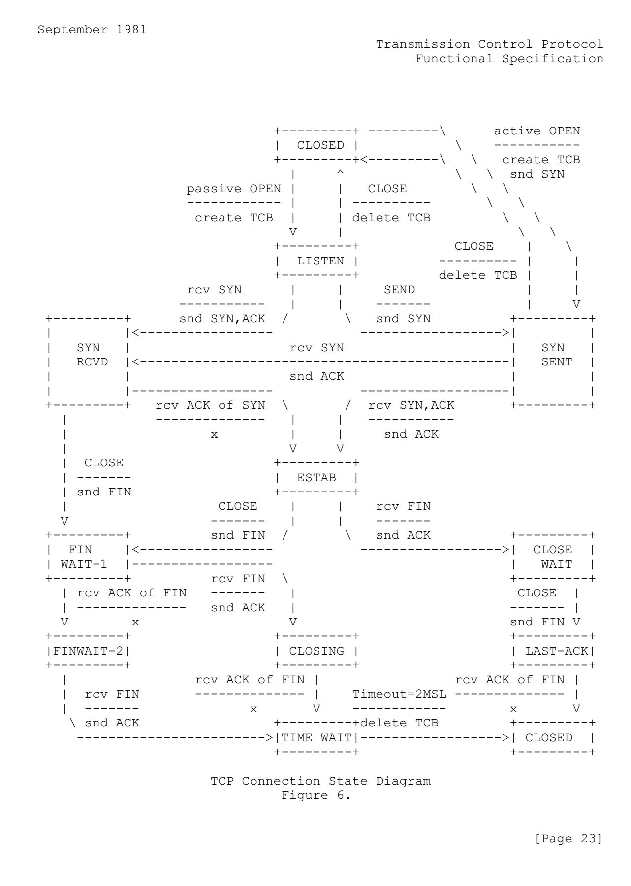

在使用TCP做一些数据传输的测试时发现，Server端程序关闭再启动时常常会出现该地址或端口已被占用的错误(关闭时socket已经释放)，如下是python脚本执行时错误打印：
```shell
Traceback (most recent call last):
  File "server.py", line 35, in <module>
    sock.bind((host, port))
  File "/usr/lib64/python2.7/socket.py", line 224, in meth
    return getattr(self._sock,name)(*args)
socket.error: [Errno 98] Address already in use
```

关闭脚本使用的是"Ctrl+C"按键组合，代码中会监听`SIGINT`信号，在信号处理函数中关闭Server socket
```python
def handler(signal_num,frame):
    global sock
    print "\nYou Pressed Ctrl-C. Exit"
    sock.shutdown(socket.SHUT_RDWR)
    sock.close()
    sys.exit(signal_num)
signal.signal(signal.SIGINT, handler)
```

为什么已经释放的socket再次绑定时会出现地址被占用的错误？

使用netstat命令查看占用的端口，发现存在一个处于`TIME_WAIT`的连接
```shell
[root@localhost awokezhou]# netstat -tn | grep "9091"
tcp        0      0 172.16.79.132:9091      172.16.79.182:64775     TIME_WAIT
```

## TCP连接状态

查看RFC-793文档，阅读了其中和TCP状态转换相关的内容

### Connect States
RFC-793中定义了一个TCP Connect在其生命周期的所有状态，原文如下
* **LISTEN** represents waiting for a connection request from any remote TCP and port
* **SYN-SENT** represents waiting for a matching connection request after having sent a connection request
* **SYN-RECEIVED** represents waiting for a confirming connection request acknowledgment after having both received and sent a connection request
* **ESTABLISHED** represents an open connection, data received can be delivered to the user. The normal state for the data transfer phase of the connection
* **FIN-WAIT-1** represents waiting for a connection termination request from the remote TCP, or an acknowledgment of the connection termination request previously sent
* **FIN-WAIT-2** represents waiting for a connection termination request from the remote TCP
* **CLOSE-WAIT** represents waiting for a connection termination request from the local user
* **CLOSING** represents waiting for a connection termination request acknowledgment from the remote TCP
* **LAST-ACK** represents waiting for an acknowledgment of the connection termination request previously sent to the remote TCP (which includes an acknowledgment of its connection termination request)
* **TIME-WAIT** represents waiting for enough time to pass to be sure the remote TCP received the acknowledgment of its connection termination request
* **CLOSED** represents no connection state at all

一个TCP连接共有11种状态：LISTEN、SYN-SEND、SYN-RECEIVED、ESTABLISHED、FIN-WAIT-1、FIN-WAIT-2、CLOSE-WAIT、CLOSING、LAST-ACK、TIME-WAIT和CLOSED

重点关注和连接关闭有关的几个状态
* **FIN-WAIT-1** 等待远端的连接终止请求，或者等待自己发送的连接终止请求被远端确认
* **FIN-WAIT-2** 等待远端的连接终止请求
* **CLOSE-WAIT** 等待本地用户的连接终止请求
* **CLOSING** 等待自己发送的连接终止请求被远端确认
* **LAST-ACK** 等待自己发送的连接终止请求被远端确认
* **TIME-WAIT** 表示等待足够的时间以确保远端收到自己的终止请求确认
* **CLOSED** 表示连接已经被完全关闭

只从字面意思理解，这几个状态有很多相似的地方，并不能理解到每个状态位于什么阶段

### 状态转移
RFC-793文档中有一个TCP连接的状态转换示意图


由该图可以看出以下区别

* **FIN-WAIT-1** 有两种情况会触发该状态：
    * Server端在接收到Client端的连接请求后就主动关闭连接，向Client发送FIN后立即进入`FIN-WAIT-1`状态
    * 建立连接后(双方都进入`ESTABLISHED`)，任何一方主动关闭连接，向对端发送FIN后立即进入`FIN-WAIT-1`状态
* **FIN-WAIT-2** 只有处于`FIN-WAIT-1`的一方收到对方的FIN ACK后，立即进入该状态
* **CLOSE-WAIT** 建立连接后，收到远端FIN后，回复FIN ACK，立即进入该状态
* **CLOSING** 只有处于`FIN-WAIT-1`的一方收到对方FIN后，进入该状态
* **LAST-ACK** 只有处于`CLOSE-WAIT`的一方主动关闭连接，向对方发送FIN后，进入该状态
* **TIME-WAIT** 只有处于`FIN-WAIT-12`的一方收到对方FIN后，进入该状态

按照该图的状态转移流程，其实主要的转移路线有以下两条：
```bash
FIN-WAIT-1 --> FIN-WAIT-2 --> TIME-WAIT --> CLOSED
CLOSE-WAIT --> LAST-ACK --> CLOSED
```

这两条路线的区别在于谁先发起连接终止请求，也就是谁先关闭socket

### MSL
先关闭连接的一方最终会进入`TIME-WAIT`状态，由`TIME-WAIT`状态切换到`CLOSED`状态，但是中间需要等待一个超时时间2MSL。正是由于这个2MSL超时时间的存在，导致Server再次bind时发生错误

提出以下3个问题
* 什么是MSL，为什么需要MSL？
* 先关闭的一方，接收到对端的FIN，发送FIN ACK后直接释放连接资源不行吗，为什么需要等待2个MSL时间？
* 后关闭的一方，为什么不需要MSL？

#### 什么是MSL
MSL英文全称是"Maximum Segment Lifetime"，即TCP片的最大存活时间

RFC-793原文中对于MSL的解释如下
```
Knowing When to Keep Quiet

To be sure that a TCP does not create a segment that carries a sequence number which may be duplicated by
an old segment remaining in the network, the TCP must keep quiet for a maximum segment lifetime (MSL) before
assigning any sequence numbers upon starting up or recovering from a crash in which memory of sequence numbers
in use was lost. For this specification the MSL is taken to be 2 minutes. This is an engineering choice, and
may be changed if experience indicates it is desirable to do so. Note that if a TCP is reinitialized in some
sense, yet retains its memory of sequence numbers in use, then it need not wait at all; it must only be sure
to use sequence numbers larger than those recently used.
```
大意为：为了确保TCP不会创建一个序列号与网络中已经存在的分片序列号重复的分片，在分配新的序列号之前必须在MSL时间内保持静默。标准规定的MSL时间为2分钟，是一个基于工程经验的选择

#### `TIME-WAIT`后为什么需要等待2个MSL？

为了保证处于`FIN-WAIT-2`状态(记为A)时发送的最后一个ACK能够到达对端(记为B)。最后一个ACK可能在网络中丢失，使得B处于`LAST-ACK`状态无法进入`CLOSED`状态。B会超时重传这个FIN，A发送ACK丢失+B重传FIN到达A，这个时间刚好是2倍的MSL

#### 后关闭的一方，为什么不需要2MSL？
2MSL本质上是在等待最后一个ACK，后关闭的一方是FIN的发送方，等待ACK，有重传机制作保障，其状态是可控的，因此不需要其他等待超时

## 测试
### 环境介绍
* **Server端** centos7虚拟机，IP地址172.16.79.132, python2.7，创建socket绑定localhost、9091端口
* **Client端** windows10，IP地址172.16.79.182，python2.7，创建socket向Server发起连接
* linux 使用如下命令查看连接状态
```shell
netstat -tn | grep '9091'
```
* windows使用如下命令查看连接状态
```shell
netstat -tn | findstr '9091'
```

### 创建连接
Server创建socket代码
```python
import socket
s = socket.socket()
host = '0.0.0.0'
port = 9091
s.bind((host, port))
s.listen(5)

c, addr = s.accept()
```

Client创建socket并向
```python
import socket
s = socket.socket()
s.connect(('172.16.79.132', 9091))
```

查看Server连接状态
```shell
[root@localhost awokezhou]# netstat -tn | grep "9091"
tcp        0      0 172.16.79.132:9091      172.16.79.182:51725     ESTABLISHED
```
查看Client连接状态
```shell
λ  netstat -tn | findstr '9091'
  TCP    172.16.79.182:51725    172.16.79.132:9091     ESTABLISHED     InHost
```

双方都进入了`ESTABLISHED`状态，表明连接建立成功

### Server先关闭socket
Server关闭连接
```python
c.close()
```

查看Server连接状态
```shell
[root@localhost awokezhou]# netstat -tn | grep "9091"
tcp        0      0 172.16.79.132:9091      172.16.79.182:51725     FIN_WAIT2
```
查看Client连接状态
```shell
λ  netstat -tn | findstr '9091'
  TCP    172.16.79.182:51725    172.16.79.132:9091     CLOSE_WAIT      InHost
```

Client关闭连接
```python
c.close()
```

查看Server连接状态
```shell
[root@localhost awokezhou]# netstat -tn | grep "9091"
tcp        0      0 172.16.79.132:9091      172.16.79.182:51725     TIME_WAIT
```
查看Client连接状态
```shell
λ  netstat -tn | findstr '9091'
```

Server最终进入了`TIME-WAIT`状态，Client连接已经释放。如果此时关闭并重启Server，在调用bind时就会报错

### Client先关闭socket
Client关闭连接
```python
s.close()
```

查看Server连接状态
```shell
[root@localhost awokezhou]# netstat -tn | grep "9091"
tcp        1      0 172.16.79.132:9091      172.16.79.182:51740     CLOSE_WAIT
```
查看Client连接状态
```shell
λ  netstat -tn | findstr '9091'
  TCP    172.16.79.182:51740    172.16.79.132:9091     FIN_WAIT_2      InHost
```

Server关闭连接
```python
c.close()
```

查看Server连接状态
```shell
[root@localhost awokezhou]# netstat -tn | grep "9091"
```
查看Client连接状态
```shell
λ  netstat -tn | findstr '9091'
  TCP    172.16.79.182:51740    172.16.79.132:9091     TIME_WAIT       InHost
```

Client再次发起连接
```python
s = socke.socket()
s.connect(('172.16.79.132', 9091))
```

查看Client连接状态
```shell
λ  netstat -tn | findstr '9091'
  TCP    172.16.79.182:51740    172.16.79.132:9091     TIME_WAIT       InHost
  TCP    172.16.79.182:51750    172.16.79.132:9091     ESTABLISHED     InHost
```

上一个连接还处于`TIME-WAIT`状态，但是又创建了一个新的连接。如果重启Client并不会报错，因为Client不用bind端口和地址

## 总结
socket关闭后端口仍然占用的错误原因是Server端先关闭了连接，再次重启时旧连接并未释放，而是处于`TIME-WAIT`状态导致的。解决该问题有如下几种方法
* Server端创建socket时设置端口重用`SO_REUSEADDR`
* 等待2MSL超时之后再创建socket
* Server端不要先关闭连接，让Client先关闭连接

## Reference
RFC-793 [PDF](/download/TCP-socket关闭后端口仍然占用/rfc793.txt.pdf)
[服务器大量的fin_wait1 状态长时间存在原因分析](https://www.cnblogs.com/10087622blog/p/7281883.html)
[网络的FIN_WAIT_2状态解释和分析](https://kld208.iteye.com/blog/1626701)
[TCP 协议（TIME_WAIT 状态](https://blog.csdn.net/q1007729991/article/details/69686781)
[TCP TIME-WAIT](https://www.cnblogs.com/gtarcoder/articles/10699965.html)
[TCP在FIN_WAIT1状态到底能持续多久以及TCP假连接问题](https://blog.csdn.net/dog250/article/details/81697403)
[防止linux出现大量 FIN_WAIT1,提高性能](https://blog.csdn.net/talent210/article/details/65441819)
[深入理解TCP(2)TCP的断开一定是四次挥手吗?FIN_WAIT_2和CLOSE_WAIT，TIME_WAIT以及LAST_ACK的细节](https://blog.csdn.net/kkgbn/article/details/77859881)
[TCP/IP中MSL详解](https://blog.51cto.com/10706198/1775555)
[Time-wait状态(2MSL)一些理解](https://blog.csdn.net/overstack/article/details/8833894)
