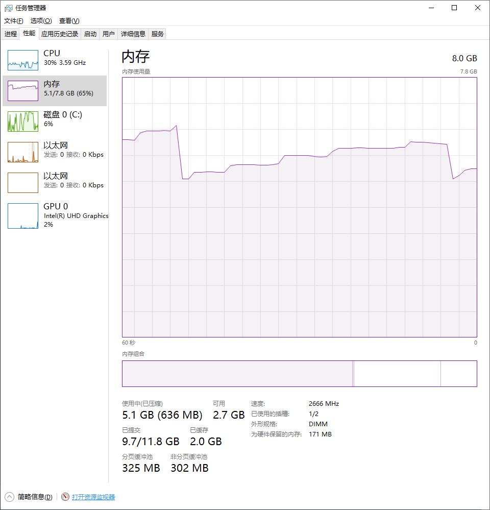

最近在研究天池竞赛的城市计算AI挑战赛题目，在编写代码过程中发现一个非常诡异的事情，最后经过一系列排查，
最终定位到是在使用linecache模块处理大文件时发生了内存溢出

## 问题描述
赛题给出了杭州市2019年1月1日到1月25日的3条地铁线路81个站点的刷卡数据，每天一个文件，25天共25个文件。
文件类型为.csv文件，文件中以行为单位记录了每个刷卡事件，包括时间、地铁线、站点、用户、刷卡类型等，每个文件大小160M左右，行数在250万行左右

### 为什么使用linecache？
按理说.csv文件，python直接使用csv模块来操作就行了，为啥还要用linecache呢？因为效率！

csv读文件的方式为`cvs.reader(fileobj)`，该函数返回一个可迭代对象，代码中使用`for`循环来遍历每一行，然后做操作。但是当我对25天的数据做统计分析时，依次读取25个文件，按行遍历，结果是要将近2个小时才能处理完，太慢了！

经过查阅资料结合自己分析，单次循环我的操作复杂度并不高，所以性能的瓶颈应该在csv的I/O操作上，而这种I/O操作又不能用并发的方式去做，大文件的处理应该使用批量化

网上有人说可以用linecache读取文件的指定行，所以我封装了一个简单的批量化操作文件的类`Batch`，代码入下
```python
class Batcher(object):

    def __init__(self, filename, batch_size=2000, offset=0, end=None):
        self.filename = filename
        try:
            self._n_lines = lines(self.filename)
        except Exception as e:
            print e

        if batch_size > self._n_lines:
            self._size = self._n_lines
            self._n_batchs = 1
            print 'batch_size too big, adjust to file lines {}'.format(self._n_lines)
        else:
            self._size = batch_size
            self._n_batchs = (self._n_lines/self._size) + 1
        self._offset = offset
        self._end = end
        self.getlines = linecache.getlines
        self.clearcache = linecache.clearcache

    def _batch(self):
        if self._end and self._offset >= self._end:
            return None
        offset = self._offset
        size = self._size
        end = offset+size
        batch = self.getlines(self.filename)[offset:end]
        self._offset += size
        return batch

    def __iter__(self):
        while True:
            batch = self._batch()
            if not batch:
                break
            yield batch
```

思路是利用`yield`将Batch做成一个可遍历的生成器，每次返回一个小批量的数据，而小批量数据的获得就通过linecache来做，最后在一个循环中来使用就行了，例如：
```python
batcher = Batcher(filename, 2000)
for batch in batcher:
    ......
```

实践证明该方法确实将时间压缩了很多，单个文件处理速度5秒左右，处理25个文件时间只花了2分43秒
```python
>>> from analysis import DataAnalysis
>>> da = DataAnalysis()
>>> flows = da.subway_line_analysis('2019-01-01')
one file calculating: 100%|██████████| 127/127 [00:05<00:00, 26.54it/s]
>>> flows = da.subway_line_analysis()
subway line calculating: 100%|██████████| 25/25 [02:43<00:00,  6.90s/it]
>>>
```

### 问题
处理单个文件时并没有发生异常情况，而在处理多个文件时，每个文件会返回一个统计列表，其中几个统计列表会是空的，代码逻辑类似
```python

def process_one(file):
    list = []
    batcher = Batch(file, 20000)
    for batch in batcher:
        for line in csv.reader(batch)
        # 处理每一行
        ......
        list.append(xxx)
    return list
def process():
    for f in files:
        list = process_one(f)
        ......
```

处理单个文件的函数`process_one`的逻辑经检查是正确的，只要按代码执行顺序读到文件的每一行，返回的list一定不为空，但现象就是有几个文件的处理结果返回值为空

## 问题排查
排查问题并没有想太多，猜测到什么情况，就立即实现验证

### 文件内容不对？
最先想到的可能原因就是这些异常的文件本身内容有误，因此我单独调用`process_one`来处理单个文件，结果发现单独处理这些文件是能够返回正常值的

接着我又在`process`函数中将文件列表乱序，结果发现出现问题的文件并不固定，而是处理了8到9个文件之后一定发生一次问题，然后再处理了4到5个之后再发生一次问题...

### 打印调试
因为排除了文件本身的问题，那只能是程序逻辑执行上的问题了。我在`process_one`函数逻辑中加入了很多调试信息，尝试将出现错误的执行情况过程中运行逻辑打印出来，我在函数头部、list追加操作前后以及函数返回前都加入了调试信息

结果很奇怪，居然有两种情况
* list追加操作前后有打印信息
* list追加操作前后没有打印信息
第一种情况运行是正常的，返回值是有的。第二种是不正常现象，因为没有进行追加操作，因此list为空

但是按照程序逻辑执行，如果读每一行都正常，list是不可能为空的，怀疑是我的`Batch()`操作或者`linecache`或者`csv.reader()`可能存在使用或者执行上的问题

### 超出自己知识范围？
排查到这个地步，我觉得问题已经超出了我的知识范围，该怎么排查？我在网络上查阅csv、linecache与运行异常相关问题，没啥结果

突然想到能不能用资源管理器看出来什么门道?我一边运行程序，一边对着看资源管理器的CPU、内存等视图，结果发现每次出问题时，内存的走势都是一个断崖式下跌，如图


内存占用走势是阶梯式上升，然后突然下跌，再阶梯式上升，下跌，且下跌的时间刚好是出问题的循环

### 哪里占用内存？
很明显，是内存占用过高，python解释器或者系统强制把内存释放了，但是程序中哪里会占用内存呢？我怀疑是我的`Batch`或者列表操作。我在代码中加入了一些`del`操作，把可能占用内存的变量在使用后都释放掉，再运行程序看内存变化，结果并没有任何变化。又陷入了困境

## 分析解决
观察内存的上升，发现每次上升的的幅度差不多，感觉很像C语言的`malloc`向系统很有规律的申请了一次次内存块，程序中哪里占用内存最多呢？

我在网上查到可以用`memory_profiler`模块来分析内存，但是使用后程序运行太过缓慢，而且这个模块是必须将程序运行完后才分析显示出来，我放弃了

主要的操作是读文件，这块会比较消耗内存，文件是读取到内存中，再访问的，难道是每次读完一个文件后，内存中的内容没释放吗？我想到了linecache，`cache`不是缓存的意思吗？我怀疑可能是linecache这里操作有什么问题。我在网上查linecache和内存占用相关问题，结果发现有一篇文章恰好提到这个问题

参考连接：[python linecache读取过程](https://www.cnblogs.com/wennn/p/6725194.html?utm_source=itdadao&utm_medium=referral)

该文章中作者也是发现linecache操作导致高内存占用，他读了源码发现其实际上也是调用`readlines`函数，将文件内容预先缓存在内存中，用户才能调用`lines = readlines(file)[x:y]`获取指定行数。而linecache提供了`clearcache`方法来清理缓存

### linecache源码分析
```python
# The cache
cache = {} # The cache

def getlines(filename, module_globals=None):
    """Get the lines for a file from the cache.
    Update the cache if it doesn't contain an entry for this file already."""

    if filename in cache:
        return cache[filename][2]

    try:
        return updatecache(filename, module_globals)
    except MemoryError:
        clearcache()
        return []
```
`getlines`函数会优先从cache中获取文件内容，如果cache不存在，才会从`updatecache`函数获取

```python
def updatecache(filename, module_globals=None):
    """Update a cache entry and return its list of lines.
    If something's wrong, print a message, discard the cache entry,
    and return an empty list."""

    if filename in cache:
        del cache[filename]
    if not filename or (filename.startswith('<') and filename.endswith('>')):
        return []

    fullname = filename
    try:
        stat = os.stat(fullname)
    except Exception:
        ......
    try:
        with open(fullname, 'rU') as fp:
            lines = fp.readlines()
    except IOError:
        return []
    if lines and not lines[-1].endswith('\n'):
        lines[-1] += '\n'
    size, mtime = stat.st_size, stat.st_mtime
    cache[filename] = size, mtime, lines, fullname
    return lines
```
由最后一行可以看到，文件内容被放在cache字典结构的第3个元素中

```python
def clearcache():
    """Clear the cache entirely."""

    global cache
    cache = {}
```
清理缓存函数会将cache清空，因为我的操作里没有清空缓存，每读一次文件，cache里都会新增一个文件的全部内容

### 验证
既然是因为缓存没有清理导致的，我修改`Batch`类，在其`__del__`方法上调用`clearcache`来释放内存，这样每次操作完一个文件后，缓存清空一次，应该就不会一直占用内存了

```python
def __del__(self):
    self.clearcache()
```

修改代码，运行程序，结果竟然没有发生异常！内存视图如下

