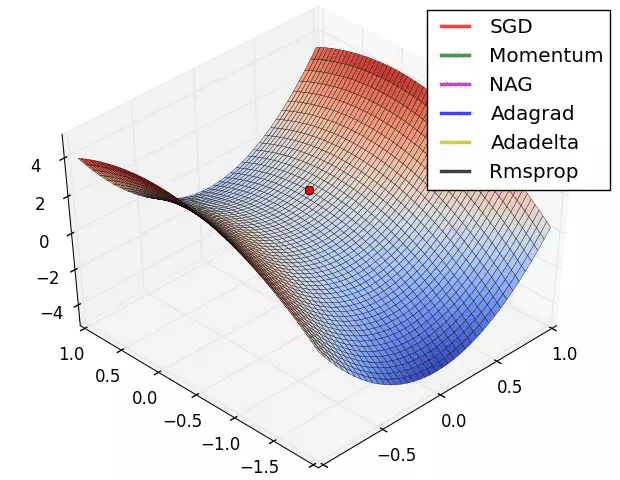
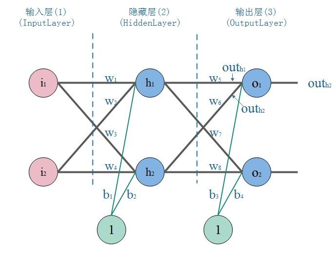

梯度下降(GD, Gradient Descent)和反向传播(BP, Back Propagation)是理解神经网络学习原理的核心，本文试图从数学原理、实例来分析梯度下降和反向传播在神经网络中是如何工作的

## 数学原理

为了理解梯度下降算法和反向传播算法的工作原理，需要理解以下数学知识
* 方向导数和梯度
* 链式法则

### 方向导数
梯度在数学中的概念，源于方向导数。在一元函数中，我们用导数来描述和分析函数的变化趋势，二元函数或多元函数我们用偏导数来分析函数变化情况。但是一旦变成多元，偏导数只能反应在坐标轴方向的变化情况，如果想要知道函数在任意方向上的变化情况，偏导数是无法做到的。因此引入了方向导数的概念

$l$ 是 $xOy$ 平面上以 $P_{0}(x_{0},y_{0})$ 为起点的一条射线，$e_{l}=(\cos{\alpha},\cos{\beta})$ 是与 $l$ 同方向的单位向量，$P$ 为射线上另一点。如果函数 $z = f(x,y)$ 的增量 $f(x_{0}+t\cos{\alpha}, y_{0}+t\cos{\beta})$ 与 $P$ 到 $P_{0}$ 的距离 $\left|PP_{0}\right| = t$ 比值 
$$
\frac{f(x_{0}+t\cos{\alpha}, y_{0}+t\cos{\beta}) - f(x_{0}, y_{0})}{t}
$$

当 $P$ 趋于 $P_{0}$ 时的极限存在，则称此极限为函数在点 $P_{0}$ 沿着射线 $l$ 的方向导数。简单来说，方向导数就是函数在某一点上(当然这一点必须是在函数上的)，沿着某一个方向的变化率，但是方向导数并不是在任何方向上都存在，有定理：
* 如果函数在某一点可微，函数在该点的任何方向的方向导数存在 

### 梯度
函数在很多方向上都有方向导数，那么在哪个方向上变化率最大呢？

如果函数在点 $P_{0}$ 可微，$e_{l} = (cos\alpha, cos\beta)$ 是与方向 $l$ 同方向的单位向量，则方向导数可以写成如下形式

$$
\frac{\partial f}{\partial l} = \nabla f\left ( x_{0}, y_{0} \right ) \cdot e_{l} = \left | \nabla f\left ( x_{0}, y_{0} \right ) \right |cos\theta
$$

其中 $\nabla f\left ( x_{0},y_{0} \right )$ 就是梯度，$\theta$ 是梯度与单位向量的夹角。反过来，可以将方向导数看做梯度在任意方向上的投影，当这个夹角 $\theta$ 为0时，表示方向导数与梯度同方向，函数增长速度最快，当夹角 $\theta$ 为180度时，方向导数与梯度方向相反，函数减小最快 

梯度的表达式为

$$
\nabla{f} = [\frac{\partial f}{\partial x}, \frac{\partial f}{\partial y}]
$$

本质上是函数的各个偏导数合成的向量

### 链式法则
微积分中的链式法则用于计算复合函数的导数。设$x$为实数，$f$和$g$是从实数映射到实数的函数，假设$y=g(x)$且$z=f(g(x))=f(y)$，那么链式法则为

$$
\frac{\partial z}{\partial x} = \frac{\partial z}{\partial y}\frac{\partial y}{\partial x}
$$

扩展到向量，假设$\boldsymbol{x} \in \mathbb{R}^{m}$，$\boldsymbol{y} \in \mathbb{R}^{n}$，$g$是从$\mathbb{R}^{m}$到$\mathbb{R}^{n}$的映射，$f$是从$\mathbb{R}^{n}$到$\mathbb{R}$的映射，如果$\boldsymbol{y}=g(\boldsymbol{x})$且$z=f(\boldsymbol{y})$。那么
$$
\frac{\partial z}{\partial x_{i}} = \sum_{j}\frac{\partial z}{\partial y_{i}}\frac{\partial y_{i}}{\partial x_{i}}
$$

使用向量写法，可等价为
$$
\nabla_{x}{z} = \left(\frac{\partial \boldsymbol{y}}{\partial \boldsymbol{x}}\right)^{T}\nabla_{y}{z}
$$

其中$\frac{\partial \boldsymbol{y}}{\partial \boldsymbol{x}}$是$g$的$n \times m$的Jacobian矩阵

## 梯度下降
梯度下降属于神经网络中优化器的一种，另外还有AdaGrad、RMSProp、Adam等。由于梯度永远指向函数增长最快的方向，那么函数下降最快的方向就是负梯度$-\nabla{f}$。梯度下降算法的思想是构造一个迭代过程，每次都使得损失函数$L$在负梯度的方向步进一点，经过若干次迭代后，函数值最终会逼近极值，这时网络学习收敛

设$\Delta{f}$为每次迭代时函数的变化量，可设置为

$$
\Delta{f} = -\eta{\nabla{f}}
$$

其中$\eta$是一个很小的正数，称为*学习速率*

在每次迭代时$\omega$按照如下规则更新

$$
\omega -> \acute{\omega} = \omega - \eta{\nabla{f}}
$$

$b$的更新规则同上。整个迭代过程可以想象为在山谷中下落的小球，小球从山顶会沿着最短路径慢慢滚到谷底，如下图所示


## 反向传播
反向传播这个术语经常被误认为只是用于神经网络的整个学习算法中，实际上反向传播算法只是用于计算梯度的方法，它可以用来计算任何函数的导数。由于按照梯度的定义直接求解是非常复杂的，反向传播能够使用非常简单的计算步骤来求解梯度

### 链式法则求复合函数的导数
反向传播的核心在于运用链式法则，以下使用函数$f(x,y,z) = (x+y)*z$来说明整个过程。可将公式拆分为两部分$q=x+y$和$f=qz$

```python
# input value
x = -2
y = 5
z = -4

# forward propagation
q = x + y           # q become 3
f = q*z             # f become -12

# back propagation
dfdz = q            # q=3, dfdz = 3
dfdq = z            # z=-4, dfdq = -4
dfdx = 1.0 * dfdq   # dqdx=1, dfdq=-4, dfdx=-4
dfdy = 1.0 * dfdq   # dqdy=1, dfdq=-4, dfdy=-4
```

对于输入`x=-2, y=5, z=-4`先进行前向传播，依次向后计算，最后得出函数值为-12，前向传播的方向为从输入到输出(绿色)。反向传播(红色)是从输出开始，根据链式法则递归的向前计算梯度，梯度在链路中回流。最终计算得到梯度`[dfdx, dfdy, dfdz]`为`[-4,-4,3]`，如图所示


### 反向传播的直观理解——门单元间梯度的传递
任何可微的函数都可以看做若干个门单元的组合形式，例如加法门、乘法门、除法门、取最大值门等
$$
\begin{align*}
f(x) &= \frac{1}{x} \to \frac{df}{dx} = -\frac{1}{x^{2}} \\
f(x) &= a + x \to \frac{df}{dx} = 1 \\
f(x) &= e^{x} \to \frac{df}{dx} = e^{x} \\
f(x) &= ax \to \frac{df}{dx} = a \\
\end{align*}
$$

在整个计算图过程中，每个单元门都会得到一些输入，并计算两个东西：
* 这个门的输出
* 其输出值关于输入值的局部梯度$\nabla{a}$

在反向传播过程中，门单元会获得整个网络输出值在自己的输出值上的梯度$\nabla{b}$，由链式法则可知，将$\nabla{b}$乘以$\nabla{a}$可得到整个网络的输出对于该门的每个输入的梯度

在梯度的回流中，不同的门单元有不同的作用。下图展示了一个反向传播的例子，加法操作将梯度相等地分发给它的输入。取最大操作将梯度路由给更大的输入。乘法门拿取输入激活数据，对它们进行交换，然后乘以梯度


### 神经网络中的反向传播
在神经网络中，反向传播是对权重和偏置变化影响代价函数$C$过程的理解，最终目的是为了计算偏导数$\frac{\partial C}{\partial \boldsymbol{\omega}}$和$\frac{\partial C}{\partial \boldsymbol{b}}$。定义网络中第$l$层第$j$个神经元上的误差$\delta_{j}^{l}$为
$$
\delta_{j}^{l} = \frac{\partial C}{\partial z_{j}^{l}}
$$
其中$z_{j}^{l}$是第$l$层第$j$个神经元的输出。向量化第$l$层的误差向量为$\boldsymbol{\delta}^{l}$。反向传播提供一种计算每层误差的方法，并将这些误差关联到$\frac{\partial C}{\partial \boldsymbol{\omega}}$和$\frac{\partial C}{\partial \boldsymbol{b}}$上

#### 反向传播的四个基本方程
定义$\boldsymbol{\delta}^{L}$表示输出层误差，对于每个元素，其误差为
$$
\begin{align*}
\delta_{j}^{L} &= \frac{\partial C}{\partial z_{j}^{L}} \\
               &= \frac{\partial C}{\partial a_{j}^{L}}\sigma'(z_{j}^{L})
\end{align*}
$$

其向量形式为公式(BP1)
$$
\boldsymbol{\delta}^{L} = \nabla_{a}{C}\ \odot sigma'(\boldsymbol{z}^{L}) \tag{BP1}
$$

使用下一层误差$\boldsymbol{\delta}^{l+1}$表示当前层误差$\boldsymbol{\delta}^{l}$
$$
\boldsymbol{\delta}^{l} = \left((\boldsymbol{\omega}^{l+1})^{T}\boldsymbol{\delta}^{l+1} \right) \odot \sigma'(\boldsymbol{z}^{l}) \tag{BP2}
$$
其中$\odot$表示Hadamard乘积。通过公式BP1和(BP2)可以计算任意层的误差$\boldsymbol{\delta}^{l}$，首先使用公式BP1计算输出层误差$\boldsymbol{\delta}^{L}$，然后应用BP2计算$\boldsymbol{\delta}^{L-1}$，然后依次计算完整个网络

代价函数关于网络中任意偏置的改变率为
$$
\frac{\partial C}{\partial b_{j}^{l}} = \delta_{j}^{l}
$$
这表示误差就是偏置的偏导数，向量形式为
$$
\frac{\partial C}{\partial \boldsymbol{b}^{l}} = \boldsymbol{\delta}^{l} \tag{BP3}
$$

代价函数关于权重的改变率为
$$
\frac{\partial C}{\partial \omega_{jk}^{l}} = a_{k}^{l-1}\delta_{j}^{l}
$$
向量形式为
$$
\frac{\partial C}{\partial \boldsymbol{\omega}^{l}} = \boldsymbol{a}^{l-1}\boldsymbol{\delta}^{l} \tag{BP4}
$$

显示的描述反向传播的步骤
1. **输入**$\boldsymbol{x}$：为输入层设置对应的激活值$\boldsymbol{a}^{1}$
2. **前向传播**：对每个层，计算相应的$\boldsymbol{z}^{l}=\boldsymbol{\omega}\boldsymbol{a}^{l-1}$和$\boldsymbol{a^{l}}=\sigma(\boldsymbol{z}^{l})$
3. **输出层误差**$\boldsymbol{\delta}^{L}$：通过BP1计算
4. **反向传播误差**：通过BP2计算
5. **更新**$\boldsymbol{\omega}和\boldsymbol{b}$：通过BP3和BP4计算

## 实例
以下图网络结构举例来说明反向传播算法是如何工作的


### 初始化参数
网络中由输入层、1层隐藏层和输出层共3层构成，按照以下参数初始化网络

```python
# 初始化输入输出
i = [0.1, 0.2]
o = [0.01, 0.99]

# 初始化权重和偏置
w = [0.1, 0.2, 0.3, 0.4, 0.5, 0.6, 0.7, 0.8]
b = [0.55, 0.56, 0.66, 0.67]
```
### 正向传播
```python
# 计算隐藏层神经元 h1 的输入加权和
h1_in = w[0]*i[0] + w[1]*i[1] + b[0] # h1_in = 0.1*0.1+0.2*0.2+0.55 = 0.6000000000000001
# 计算隐藏层神经元 h1 的输出
h1_out = sigmoid(h1_in) # h1_out = 0.6456563062257954

# 计算隐藏层神经元 h2 的输入加权和
h2_in = w[2]*i[0] + w[3]*i[1] + b[1] # h2_in = 0.3*0.1+0.4*0.2+0.56 = 0.67
# 计算隐藏层神经元 h1 的输出
h2_out = sigmoid(h2_in) # h2_out = 0.6615031592029524

# 计算输出层神经元 o1 的输入加权和
o1_in = w[4]*h1_out + w[5]*h2_out + b[2] # o1_in = 0.5*0.6456563062257954 + 0.6*0.6615031592029524 + 0.66 = 1.379730048634669
# 计算输出层神经元 o1 的输出
o1_out = sigmoid(o1_in) # o1_out = 0.7989476413779711

# 计算输出层神经元 o2 的输入加权和
o2_in = w[6]*h1_out + w[7]*h2_out + b[3] # o2_in = 0.7*0.6456563062257954 + 0.8*0.6615031592029524 + 0.67 = 1.6511619417204186
# 计算输出层神经元 o2 的输出
o2_out = sigmoid(o2_in) # o2_out = 0.8390480283342561
```

正向传播结束后的输出结果为`[0.7989476413779711, 0.8390480283342561]`，但是希望的输出是`[0.01, 0.99]`，因此利用反向传播更新权重和偏置，然后重新计算输出

### 反向传播
代价函数使用
$$
C = \frac{1}{2}\sum_{j}\left(y_{j} - a_{j}^{l} \right)
$$

其导数为
$$
\frac{\partial C}{\partial a_{j}^{l}} = a_{j} - y_{j}
$$

根据BP1，输出层神经元的误差$\delta_{j}^{3}$计算方法为
$$
\begin{align*}
\delta_{j}^{3} &= \nabla_{a}{C}*\sigma'(z_{j}^{3}) \\
               &= (a_{j}^{3} - y_{j})*(a_{j}^{3}*(1-a_{j}^{3}))
\end{align*} 
$$

```python
# 计算输出层神经元 o1 的误差
o1_err = (o1_out - o[0])*(o1_out*(1-o1_out)) # o1_err = 0.12672890240521031
# 计算输出层神经元 o2 的误差
o2_err = (o2_out - o[1])*(o2_out*(1-o2_out)) # o2_err = -0.020385525551585255
```

根据BP2，隐藏层神经元的误差$\delta_{j}^{2}$计算方法为
$$
\delta_{j}^{2} = ((\boldsymbol{\omega}^{3})^{T}\boldsymbol{\delta}^{3}) \odot \sigma'(z_{j}^{2})
$$

在计算时只需要计算与该神经元相关的连接，例如计算隐藏层神经元`h1`时，只需要计算权重`w5`和`w7`，设$\omega_{jk}^{l}$表示从$(l-1)$层第$k$个神经元到第$l$层第$j$个神经元的权重
$$
\delta_{1}^{2} = (\omega_{11}^{3}*\delta_{1}^{3} + \omega_{12}^{3}*\delta_{1}^{3})*(a_{1}^{2}*(1-a_{1}^{2}))
$$

```python
# 计算隐藏层神经元 h1 的误差
h1_err = (w[4]*o1_err + w[6]*o2_err)*(h1_out*(1-h1_out)) # h1_err = 0.011232066954600498
# 计算隐藏层神经元 h2 的误差
h2_err = (w[5]*o1_err + w[7]*o2_err)*(h2_out*(1-h2_out)) # h2_err = 0.013374304651329562
```

根据BP4可计算某个权重的偏导数，例如`w5`，其偏导数为
$$
\frac{\partial C}{\partial \omega_{11}^{3}} = a_{1}^{2}*\delta_{1}^{3}
$$

```python
# 计算权重 w5 的偏导数
d_w5 = o1_err*h1_out # d_w5 = 0.08182331501899741
# 计算权重 w1 的偏导数
d_w1 = h1_err*i[0] # d_w1 = 0.0011232066954600499
```


## 参考
* [知乎-梯度的方向为什么是函数值增加最快的方向？](https://zhuanlan.zhihu.com/p/38525412)
* [知乎-如何直观形象的理解方向导数与梯度以及它们之间的关系？](https://www.zhihu.com/question/36301367/answer/156102040)
* [博客园-刘建平Pinard-梯度下降（Gradient Descent）小结](https://www.cnblogs.com/pinard/p/5970503.html)
* [知乎-AI从入门到放弃：BP神经网络算法推导及代码实现笔记](https://zhuanlan.zhihu.com/p/38006693)
* [CS231n-Backpropagation, Intuitions](http://cs231n.github.io/optimization-2/#backprop)
* [CS231n-Optimization: Stochastic Gradient Descent](http://cs231n.github.io/optimization-1/)
* [MIT Press book:Deep Learning](http://www.deeplearningbook.org/)
* [Michael Nielsen:Neural Networks and Deep Learning](http://neuralnetworksanddeeplearning.com/)