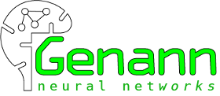

# 工具
* [videodownloader](https://github.com/mayeaux/videodownloader)
一个使用Electron制作的Youtube-dl的图形界面，可以下载包括Youtube、优酷、网易云音乐等在内的110个网站的视频

* [lazydocker](https://github.com/jesseduffield/lazydocker)
命令行管理Docker服务的一个图形界面工具

# 新闻
* [生菜收割机器人](https://www.cam.ac.uk/research/news/robot-uses-machine-learning-to-harvest-lettuce)
英国剑桥大学开发了一个收割生菜的机器人。它用摄像头识别出每棵生菜，然后使用机器学习算法判断是否生长成熟，有没有感染疾病，如果一切正常，就进行收割

* [华为发布HarmonyOS 鸿蒙操作系统](https://www.zhihu.com/question/339567108/answer/781523669)
2019年8月9日，华为在其开发者大会上正式向全球发布了其自研的HarmonyOS。该系统是基于微内核的面向全场景的分布式操作系统，具有分布架构、内核安全、生态共享、天生流畅四大优势。鸿蒙OS不同于宏内核的Linux，属于微内核，并且属于seL4阶段，能够进行形式化验证(数学方法验证Bug Free)，仅仅将时钟管理、内存、中断、网络等内容放在微核中，其他系统级服务都在应用层以服务的形式提供，因此微内核代码量很小(9000行)

# 开源
* [genann](https://github.com/codeplea/genann)
Genann是一个轻量级、测试稳定的C语言神经网络库，其使用前向反馈神经网络，简单、快速、可靠、稳定

# 人物
* [Michael Nielsen](http://michaelnielsen.org/)
Michael Nielsen 是⼀位量⼦物理学家、科学作家、计算机编程研究⼈员，Neural Networks and Deep Learning(神经⽹络与深度学习)这本书的作者

# 文章
* [linux syslog 日志指南](https://devconnected.com/syslog-the-complete-system-administrator-guide/)
介绍Linux日志系统及协议的文档

* [Zdog](https://github.com/metafizzy/zdog)
一个JavaScript的3D设计和动画制作库

* [the-super-tiny-compiler](https://the-super-tiny-compiler.glitch.me/)
一个介绍编译原理的教学示例项目

