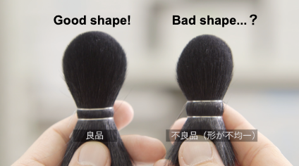
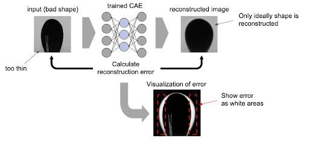
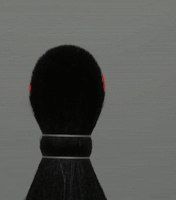

## 言论

### [算法工程师毒鸡汤](https://www.bilibili.com/video/BV1654y1B7Zi)

在B站关注的一位微软人工智能UP主讲述了一期关于算法岗应该注意什么的问题，值得学习







<iframe class="video" src="//player.bilibili.com/player.html?aid=841073548&bvid=BV1654y1B7Zi&cid=202449874&page=1" scrolling="no" border="0" frameborder="no" framespacing="0" allowfullscreen="true"> </iframe>


其实在实际工程落地的时候，算法模型本身的很多问题都是微不足道的，旺旺制约落地的关键问题，是业务、数据、迭代等与算法不相关的方面。要搞算法，前提是怎么样让自己成为一名专业的工程师，怎么样能够编写出健壮性稳定性良好的代码，了解足够的后端相关知识，再去关注算法本身

## 技术

### Tensorflow案例分享—量化匠人经验，助力文化传承

日本广岛县熊野町生产的传统工艺品“熊野笔(Kumano Fude)”拥有很长的历史，是日本最著名的毛笔。由于笔头的品质难以用机器衡量，在大多数生产制作流程中，都是人工参与，导致产量很低。

某团队利用Tensorflow搭建了一个识别熊野笔良品的量化模型，首先利用一个卷积自编码器在人工筛选的良品上进行学习，在识别时输入任意笔刷图像，将会计算模型输入和输出的差距来判断是否为良品。

最终能够输出模型认为次品有问题的地方，用红色标注

### [滴滴未来出行](https://xw.qq.com/cmsid/20200627A0AO1Y00)

滴滴在上海嘉定区开启了未来出行项目，通过部署无人驾驶网约车，用户有几率打到无人驾驶车，随车配备了安全驾驶员
