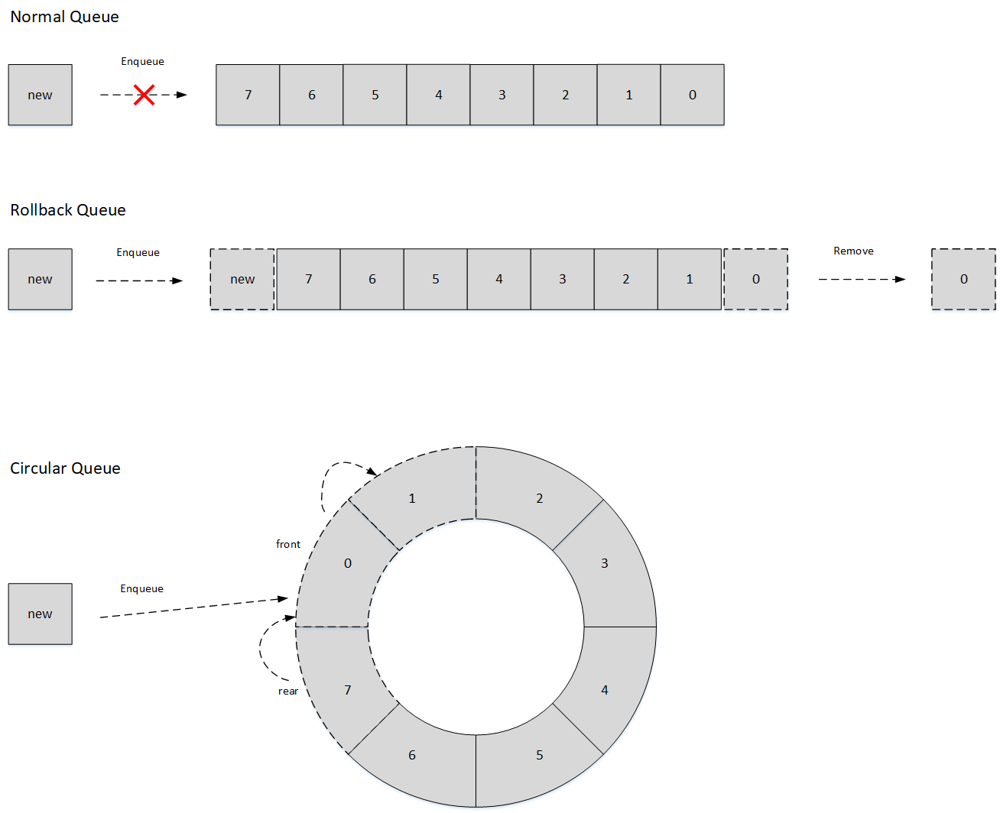

队列分两种

* Queue: 先进先出，FIFO
* Deque: 头节点尾节点都可随意进出

特点及性能

* size固定
* 查找$$O(n)$$

## Queue

Queue又分为一般队列、可回滚队列和循环队列

* 普通队列，Normal Queue
* 回滚队列，Rollback Queue
* 环形队列，Circular Deque

普通队列一旦队满不能再入队。回滚队列和环形队列队满后都再次入队，回滚队列是通过移除队首元素实现，环形队列是通过覆盖队首元素并后移队首指针实现



普通队列和回滚队列结构和实现方式相似

* curr，队尾标记
* _queue，队列实体，可用array或list实现

环形队列需要队首队尾两个标记

* front，队首标记
* rear，队尾标记
* _queue，队列实体，可用array或list实现

### Normal Queue & Rollback Queue 实现(C)

```c
typedef struct _q_unit {
    int data;
} q_unit;

typedef struct _queue {
    int curr;
#define QUEUE_F_RB    0x0002
    uint16_t flag;
#define QUEUE_SIZE    8
    q_unit _queue[QUEUE_SIZE];
} queue;

#define queue_foreach(q, u)                            \
        int __k;                                    \
        u = &q->_queue[q->curr];                    \
                                                    \
        for (__k = q->curr;                            \
             (__k>=0);                                \
             __k--,                                    \
             u = &q->_queue[__k])                    \

bool queue_empty(queue *q)
{
    return ((q->curr+1) == 0);
}

bool queue_full(queue *q)
{
    return ((q->curr+1) == QUEUE_SIZE);
}

void queue_dq(queue *q, q_unit *u)
{
    int i;

    if (queue_empty(q)) {
        memset(u, 0x0, sizeof(q_unit));
        return;
    }

    memcpy(u, &q->_queue[0], sizeof(q_unit));

    for (i=0; i<q->curr; i++) {
        q->_queue[i] = q->_queue[i+1];
    }
    memset(&q->_queue[q->curr], 0x0, sizeof(q_unit));
    q->curr--;
    return;
}

void queue_eq(queue *q, q_unit *u)
{
    if (queue_full(q)) {
        if (mask_exst(q->flag, QUEUE_F_RB)) {
            q_unit _front;
            queue_dq(q, &_front);
        } else {
            return;
        }
    }

    q->curr = (q->curr+1)%QUEUE_SIZE;
    memcpy(&q->_queue[q->curr], u, sizeof(q_unit));
    return;
}

void queue_init(queue *q, uint16_t flag)
{
    memset(&q->_queue, 0x0, sizeof(queue));

    q->curr = -1;
    mask_push(q->flag, flag);
}

void queue_dump(queue *q)
{
    int max;
    int len;
    int size;
    q_unit *unit;
    size = q->curr+1;
    char *pos;
    char dump[256] = {'\0'};

    if (!size)
        return;

    len = 0;    
    max = 256;
    pos = dump;

    queue_foreach(q, unit) {
        len = snprintf(pos, max, "%d ", unit->type);
        pos += len;
        max -= len;
    }
    log_debug("queue size:%d, data: [%s]", size, dump);
    printf("\n");
}

int main(int argc, char *argv[])
{
    q_unit u;
    q_unit a, b, c, d;
    queue queue;

    queue_init(&queue, QUEUE_F_RB);

    a.type = 1;
    b.type = 2;
    c.type = 3;
    d.type = 4;

    queue_dump(&queue);

    log_debug("eq [3 1 2 2 2 2 2 4 3 2 1] --> ");
    queue_eq(&queue, &a);
    queue_eq(&queue, &b);
    queue_eq(&queue, &c);
    queue_eq(&queue, &d);
    queue_eq(&queue, &b);
    queue_eq(&queue, &b);
    queue_eq(&queue, &b);
    queue_eq(&queue, &b);
    queue_eq(&queue, &b);
    queue_eq(&queue, &a);
    queue_eq(&queue, &c);

    queue_dump(&queue);

    queue_dq(&queue, &u);
    log_debug("dq --> [%d] ", u.type);
    queue_dq(&queue, &u);
    log_debug("dq --> [%d] ", u.type);
    queue_dq(&queue, &u);
    log_debug("dq --> [%d] ", u.type);
    queue_dq(&queue, &u);
    log_debug("dq --> [%d] ", u.type);
    queue_dq(&queue, &u);
    log_debug("dq --> [%d] ", u.type);
    queue_dq(&queue, &u);
    log_debug("dq --> [%d] ", u.type);
    queue_dq(&queue, &u);
    log_debug("dq --> [%d] ", u.type);
    queue_dq(&queue, &u);
    log_debug("dq --> [%d] ", u.type);
    queue_dq(&queue, &u);
    log_debug("dq --> [%d] ", u.type);

    queue_dump(&queue);

    log_debug("eq [3 1 2 2] --> ");
    queue_eq(&queue, &b);
    queue_eq(&queue, &b);
    queue_eq(&queue, &a);
    queue_eq(&queue, &c);

    queue_dump(&queue);

    queue_dq(&queue, &u);
    log_debug("dq --> [%d] ", u.type);

    queue_dump(&queue);

    log_debug("eq [3] --> ");
    queue_eq(&queue, &c);

    queue_dump(&queue);

    queue_dq(&queue, &u);
    log_debug("dq --> [%d] ", u.type);
    queue_dq(&queue, &u);
    log_debug("dq --> [%d] ", u.type);
    queue_dq(&queue, &u);
    log_debug("dq --> [%d] ", u.type);

    queue_dump(&queue);
}
```